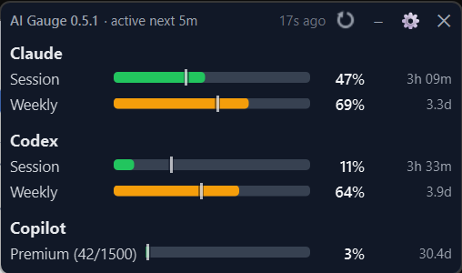
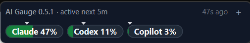
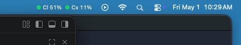
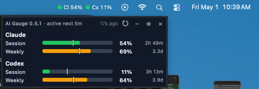
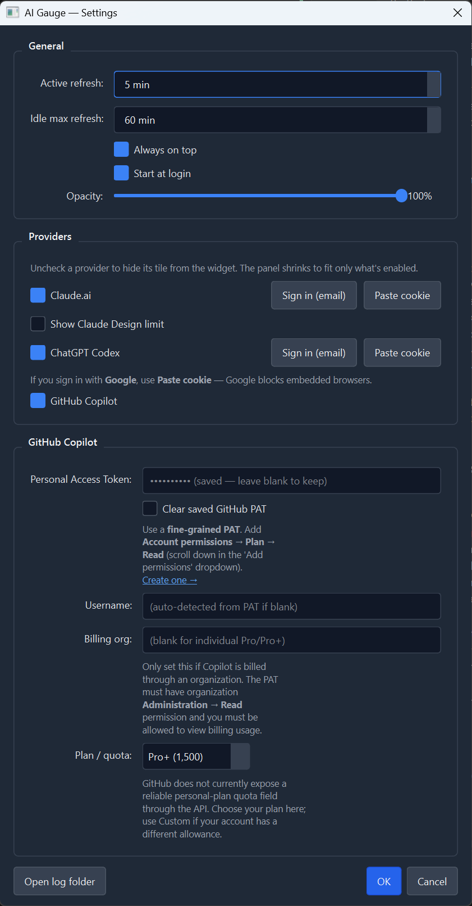

# AI Gauge

[](https://github.com/jpajak/ai-gauge/actions/workflows/test.yml)


If you pay for multiple AI subscriptions and frequently check your usage, AI Gauge might help. It shows session and weekly usage plus reset times in a compact always-visible view, so you can get the most out of what you're paying for.

Compact monitor for **Claude.ai**, **ChatGPT Codex**, and **GitHub Copilot** usage limits. Manual + auto refresh, with a platform-native UI on each OS:

- **Windows / Linux** — always-on-top draggable frameless widget plus a system-tray icon.
- **macOS** — Stats-style menu-bar item (`● 42% ● 78% ● 15%`); the panel opens as a popover when you click it.

> **Requires Python 3.11+.** Secrets live in the OS-native credential store (Windows Credential Manager / DPAPI, macOS Keychain, Linux Secret Service). Auto-start uses the platform's standard mechanism (Run key / LaunchAgent / `~/.config/autostart`).

Current version: **0.5.1**. See [CHANGELOG.md](CHANGELOG.md) for release notes.

AI Gauge is an independent open-source project and unofficial local desktop
utility. It is not affiliated with Anthropic, OpenAI, GitHub, Microsoft, or
any other provider. Provider pages and APIs may change without notice.

## Screenshots

**Windows / Linux** — always-on-top floating widget, in full panel and collapsed pill modes:

<p align="center">
  
  &nbsp;&nbsp;
  
</p>

**macOS** — Stats-style menu-bar item with per-provider tinted dots; click to open the panel as a popover:

<p align="center">
  
  &nbsp;&nbsp;
  
</p>

<details>
<summary>Settings dialog</summary>

<p align="center">
  
</p>

</details>

## Download

Pre-built binaries for each release are published on the [Releases page](https://github.com/jpajak/ai-gauge/releases). Pick the archive for your OS, extract, and run:

| OS      | Archive                              | Run                                |
| ------- | ------------------------------------ | ---------------------------------- |
| Windows | `ai-gauge-<version>-windows.zip`     | extract, run `ai-gauge.exe`        |
| macOS   | `ai-gauge-<version>-macos.tar.gz`    | extract, drag `ai-gauge.app` to Applications |
| Linux   | `ai-gauge-<version>-linux.tar.gz`    | extract, run `./ai-gauge/ai-gauge` |

SHA256 sums are published alongside each archive. Builds are unsigned — see the [first-launch warnings](#build-a-standalone-binary) section below for SmartScreen / Gatekeeper handling.

## Run from source

**Windows (PowerShell):**

```powershell
py -m venv .venv
.venv\Scripts\pip install -e .[dev]
.venv\Scripts\python -m aigauge
```

**macOS / Linux (bash):**

```bash
python3 -m venv .venv
.venv/bin/pip install -e .[dev]
.venv/bin/python -m aigauge
```

On first launch the widget appears with each enabled provider showing a **Sign in** button. Click one to start the auth flow, or open Settings to disable providers you don't use.

## First-time setup per provider

| Provider           | Setup                                                                                                                                                                                                                                                                                                                                                                                                                                       |
| ------------------ | ------------------------------------------------------------------------------------------------------------------------------------------------------------------------------------------------------------------------------------------------------------------------------------------------------------------------------------------------------------------------------------------------------------------------------------------- |
| **Claude.ai**      | **Sign in (recommended):** opens an embedded browser. <b>Don't click "Continue with Google"</b> — Google refuses to authenticate inside embedded browsers. If your account is Google-linked, just type that same email into the **Enter your email** box and use the **magic link** sent to your inbox. **Paste cookie:** fallback if magic-link is unavailable; see below.                                                                |
| **ChatGPT Codex**  | Same as Claude — use email + magic link in the embedded browser, or paste cookie as a fallback.                                                                                                                                                                                                                                                                                                                                             |
| **GitHub Copilot** | Create a **fine-grained PAT** at <https://github.com/settings/personal-access-tokens/new>. For personal Pro/Pro+, add **Account permissions → Plan → Read**. Paste into Settings; set your monthly quota (Pro=300, Pro+=1500, Business=300, Enterprise=1000). If Copilot is billed through an organization, enter the billing org and use a token/account with org billing access and **Organization permissions → Administration → Read**. |

Sessions persist between runs under the per-OS app-data directory:

| OS      | App data                                  | Secrets backend                           |
| ------- | ----------------------------------------- | ----------------------------------------- |
| Windows | `%APPDATA%/ai-gauge/`                     | Credential Manager (PAT) + DPAPI-encrypted `secrets.dat` (cookies, since the Credential Manager blob limit is too small for ChatGPT JWTs) |
| macOS   | `~/Library/Application Support/ai-gauge/` | Login Keychain                            |
| Linux   | `~/.config/ai-gauge/`                     | Secret Service (GNOME Keyring / KWallet)  |

AI Gauge does not include telemetry or a backend service. Provider requests
are made from the local app to the configured providers. See
[SECURITY.md](SECURITY.md) for security and privacy notes.

### Paste cookie (fallback)

If the embedded-browser sign-in doesn't work for you (e.g. your account requires Google sign-in and you can't use the magic-link path), copy your existing session cookie from your normal browser into the app. Cookies last weeks before they need re-pasting.

1. Sign into <https://claude.ai> (or <https://chatgpt.com>) in **Chrome / Edge / Firefox** as you normally do.
2. For ChatGPT, press **F12** → **Network**, reload the page, click a
   `chatgpt.com` request, and copy the full **Request Headers → Cookie:** value.
   This includes split session cookies plus companion auth cookies such as
   `__Secure-oai-is`.
3. For Claude, press **F12** → **Network**, reload `https://claude.ai/settings/usage`,
   click a `claude.ai` request, and copy the full **Request Headers → Cookie:**
   value. It must include `sessionKey`.
4. In the app: Settings → click **Paste cookie** next to the provider, paste, Save.

## Daily use

- **Windows / Linux:** the widget floats above other windows by default. Drag anywhere to move; close (✕) hides to tray. Right-click the tray icon for Refresh / Settings / Quit. Left-click toggles widget visibility. Tray icon turns yellow ≥75% / red ≥90% based on the highest tile reading.
- **macOS:** the menu-bar item shows one tinted dot + percent per enabled provider. Click it to open the panel as a popover; click outside to dismiss. Right-click for the same Refresh / Settings / Quit menu.
- **Linux without a system tray** (stock GNOME): the floating widget stays visible and serves the same Show / Refresh / Settings / Quit menu via right-click on the widget.
- **Collapse / expand:** click the **−** button in the widget header to shrink to the compact pill view (one colored dot + percent per provider). Click the pill to expand back to the full panel.
- **Hide unused providers:** uncheck Claude / Codex / Copilot in Settings to remove their tile from the widget — useful if you only use one or two of them.
- Auto-refresh is adaptive: manual refresh or changed usage enters the active
  cadence, then unchanged results back off toward the configured max interval.
  Defaults are 5 min active and 60 min idle max.
- Enable **Start at login** in Settings if you want it to run as a daily utility.

## Build a standalone binary

For most users the [pre-built downloads](#download) are easier — this section is for building locally or for maintainers cutting releases. The build machine needs Python 3.11+ and a `.venv` with `pip install -e .[dev]` already run; the resulting binary does **not** require Python on the target machine.

| OS      | Command          | Output                       |
| ------- | ---------------- | ---------------------------- |
| Windows | `.\build.ps1`    | `dist/ai-gauge/ai-gauge.exe` |
| macOS   | `./build.sh`     | `dist/ai-gauge.app`          |
| Linux   | `./build.sh`     | `dist/ai-gauge/ai-gauge`     |

Tagged commits matching `v*` automatically run [the release workflow](.github/workflows/release.yml), which builds all three platforms in CI and uploads them as a draft GitHub Release for the maintainer to publish.

Bundles are ~150-200 MB because the Chromium runtime ships inside. User data still lives outside the bundle, under the per-OS app-data directory.

For a single-file binary (slower first launch), pass `-OneFile` (PowerShell) or `--onefile` (bash). On macOS the `.app` bundle is recommended over the single-file form.

**First-launch warnings on signed-OS-bundle systems** — release artifacts are unsigned:

- **Windows:** SmartScreen → "More info" → "Run anyway".
- **macOS:** Gatekeeper blocks on first launch. Either right-click the `.app` → Open the first time, or run `xattr -dr com.apple.quarantine ai-gauge.app` once.
- **Linux:** no signing layer; just make `ai-gauge` executable if it isn't already.

See [RELEASING.md](RELEASING.md) for maintainer release steps.

## Tests

```powershell
.venv\Scripts\pytest          # Windows
.venv/bin/pytest              # macOS / Linux
```

Tests cover: config round-trip, Copilot REST helpers (with mocked HTTP), and snapshot models. Provider scrapers (Claude/Codex) require a live browser session and are validated manually.

## Contributing

Bug reports, provider-layout fixes, and PRs are welcome. See
[CONTRIBUTING.md](CONTRIBUTING.md) for environment setup, test commands, and
the issue templates to use.

## Notes / limitations

- **Why an embedded browser instead of reading Chrome cookies?** Chrome 127+ added App-Bound Encryption (mid-2024) that blocks every external Python library from decrypting Chrome/Edge cookies. Owning the browser session ourselves is the only reliable workaround.
- **Claude / Codex layouts may change.** If a provider tile shows "error" after a UI update upstream, the page-extractor JS in `src/aigauge/providers/{claude,codex}.py` needs adjusting — the rest of the app keeps working.
- The Copilot REST endpoint returns the _current calendar month_ of premium-request usage. The widget tracks gross premium requests consumed against the included allowance; net quantity is only the billable overage. Reset is computed as the 1st of the next month. GitHub does not currently expose a reliable personal-plan quota field, so Settings uses a plan dropdown with a Custom fallback.
- **Copilot usage lags upstream.** The Copilot REST endpoint updates noticeably slower than Claude or Codex — premium-request counts can take hours to reflect recent activity. The widget shows the most recent value GitHub returns; treat the Copilot tile as a trailing indicator, not real-time.
- **Copilot pricing model changes June 1, 2026.** GitHub is moving Copilot from per-request quotas to token-based usage. Once the switch lands, the request-count display and plan-quota dropdown will need to be reworked to track tokens instead — until then, the Copilot tile may show stale or mismatched values. Open an issue if you see this after the changeover.
