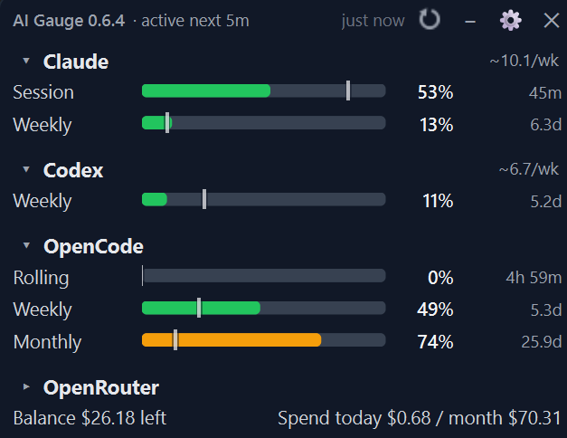
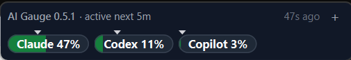
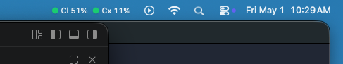
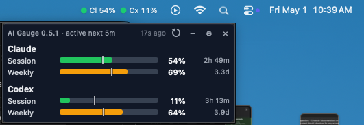
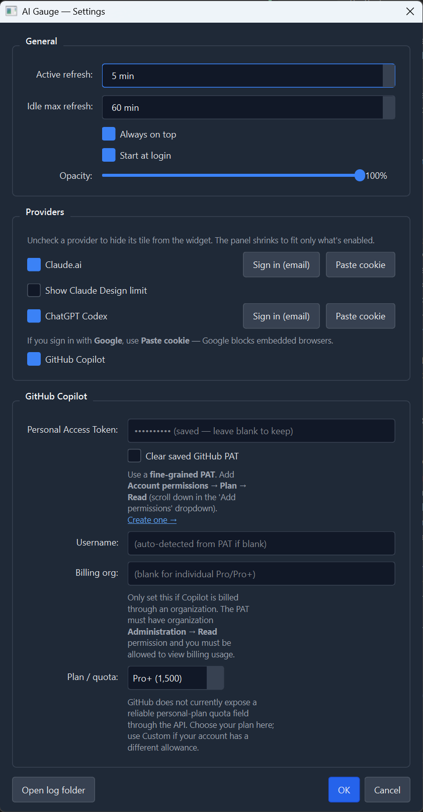

# AI Gauge

[](https://github.com/jpajak/ai-gauge/actions/workflows/test.yml)


If you pay for multiple AI subscriptions and frequently check your usage, AI Gauge might help. It shows available rolling, session, weekly, and monthly usage, reset times, account balances, and spend in a compact always-visible view, so you can get the most out of what you're paying for.

Compact monitor for **Claude.ai**, **ChatGPT Codex**, **OpenCode**, **GitHub Copilot**, and **OpenRouter** usage. Manual + auto refresh, with a platform-native UI on each OS:

- **Windows / Linux** — always-on-top draggable frameless widget plus a system-tray icon.
- **macOS** — Stats-style menu-bar item (`● 42% ● 78% ● 15%`); the panel opens as a popover when you click it.

> **Requires Python 3.11+.** Secrets live in the OS-native credential store (Windows Credential Manager / DPAPI, macOS Keychain, Linux Secret Service). Auto-start uses the platform's standard mechanism (Windows Task Scheduler / LaunchAgent / `~/.config/autostart`).

Current version: **0.7.0**. See [CHANGELOG.md](CHANGELOG.md) for release notes.

AI Gauge is an independent open-source project and unofficial local desktop
utility. It is not affiliated with Anthropic, OpenAI, GitHub, Microsoft,
OpenRouter, or any other provider. Provider pages and APIs may change without
notice.

## Screenshots

**Windows / Linux** — always-on-top floating widget, in full panel and collapsed pill modes:

<p align="center">
  
  &nbsp;&nbsp;
  
</p>

**macOS** — Stats-style menu-bar item with per-provider tinted dots; click to open the panel as a popover:

<p align="center">
  
  &nbsp;&nbsp;
  
</p>

<details>
<summary>Settings dialog</summary>

<p align="center">
  
</p>

</details>

## Download

Pre-built binaries for each release are published on the [Releases page](https://github.com/jpajak/ai-gauge/releases). Pick the archive for your OS, extract, and run:

| OS      | Archive                              | Run                                |
| ------- | ------------------------------------ | ---------------------------------- |
| Windows | `ai-gauge-<version>-windows.zip`     | extract, run `ai-gauge.exe`        |
| macOS   | `ai-gauge-<version>-macos.tar.gz`    | extract, drag `ai-gauge.app` to Applications |
| Linux   | `ai-gauge-<version>-linux.tar.gz`    | extract, run `./ai-gauge/ai-gauge` |

SHA256 sums are published alongside each archive. Builds are unsigned - see the [first-launch warnings](#build-a-standalone-binary) section below for SmartScreen / Gatekeeper handling.

## Run from source

**Windows (PowerShell):**

```powershell
py -m venv .venv
.\.venv\Scripts\python.exe -m pip install -e .[dev]
.\.venv\Scripts\python.exe -m aigauge
```

**macOS / Linux (bash):**

```bash
python3 -m venv .venv
./.venv/bin/python -m pip install -e '.[dev]'
./.venv/bin/python -m aigauge
```

On first launch the widget appears with enabled provider tiles. Claude, Codex, and OpenCode use a **Sign in** or **Paste cookie** flow; GitHub Copilot and OpenRouter are configured from Settings with API credentials. Open Settings to disable providers you don't use or to add more Claude, Codex, or OpenCode accounts.

## First-time setup per provider

| Provider           | Setup                                                                                                                                                                                                                                                                                                                                                                                                                                       |
| ------------------ | ------------------------------------------------------------------------------------------------------------------------------------------------------------------------------------------------------------------------------------------------------------------------------------------------------------------------------------------------------------------------------------------------------------------------------------------- |
| **Claude.ai**      | **Sign in (recommended):** opens a real installed Chrome-family browser, supports Google and passkeys, and connects the resulting Claude session automatically. No cookie copying is required. **Paste cookie:** remains available as a recovery fallback. Add extra Claude subscriptions from **Settings → Claude**. |
| **ChatGPT Codex**  | Same as Claude — **Sign in** opens a real installed browser and automatically connects the ChatGPT session, including Google-linked and passkey accounts. **Paste cookie** remains available only as a fallback. Add extra Codex subscriptions from **Settings → Codex**. |
| **OpenCode**       | In **Settings → OpenCode**, enter each subscription's name and workspace **Go** usage-page URL, then use **Sign in** on that row. Each subscription has an independent browser session and tile. The real-browser flow supports Google; **Paste cookie** remains available as a recovery fallback. Tiles read Rolling, Weekly, and Monthly usage from their workspace pages. |
| **GitHub Copilot** | Create a **fine-grained PAT** at <https://github.com/settings/personal-access-tokens/new>. For personal plans, add **Account permissions → Plan → Read**. Paste into Settings; set your monthly AI credit allowance (Pro=1,500, Pro+=7,000, Max=20,000). If Copilot is billed through an organization, enter the billing org and use a token/account with org billing access and **Organization permissions → Administration → Read**. |
| **OpenRouter**     | Create an inference API key at <https://openrouter.ai/keys> and paste it into Settings. To show account balance and model activity, also create a management key at <https://openrouter.ai/settings/provisioning-keys>. Management keys cannot be used for inference; AI Gauge stores it separately and only uses it for OpenRouter management endpoints. Daily spend budget is optional.                                                    |

### Multiple Claude / Codex / OpenCode accounts

Claude, Codex, and OpenCode can track more than one subscription at a time. Open the provider's Settings tab, click **Add another**, give the account a short name, then use **Sign in** or **Paste cookie** for that specific row. OpenCode rows also have their own workspace **Go** usage-page URL. Default accounts display as `Claude`, `Codex`, or `OpenCode`; named accounts display as `Claude (Work)`, `Codex (Account 2)`, `OpenCode (Team)`, etc. Every account keeps separate browser-profile and cookie storage.

The **General** tab controls provider groups. Enabling Claude, Codex, or OpenCode shows every configured account in that family. Any account can be removed from its provider tab, including the original account; the **Add another** button remains available when no accounts are configured. Each browser-backed account uses separate cookie storage, browser profile data, widget tile state, and history records.

Use **Clear sign-in** beside an account to remove its session from AI Gauge.
This clears both the OS-protected saved cookie and the account's live embedded
browser cookies. It does not revoke sessions in other browsers or devices; use
the provider's security settings when you need to sign out everywhere.

### How browser sign-in works

Google does not allow OAuth sign-in inside embedded browser controls, so AI
Gauge opens a real installed Chrome-family browser instead. The flow is local:

1. AI Gauge creates a new temporary browser profile containing none of your
   regular browser history, extensions, cookies, or saved accounts.
2. You sign in normally in that browser window, including with Google or a
   passkey.
3. AI Gauge watches the temporary browser through a random loopback-only
   debugging port and accepts cookies only for the selected provider:
   `claude.ai`, `chatgpt.com`, or `opencode.ai`.
4. The provider session is copied into that AI Gauge account's persistent
   browser profile and OS-protected secret storage. Google cookies and cookies
   for unrelated sites are ignored.
5. AI Gauge closes the temporary browser, deletes its temporary profile, and
   verifies that the provider's usage page is signed in.

Your everyday Chrome/Edge profile is never opened or inspected. The imported
provider session remains available across AI Gauge restarts, so sign-in only
needs to be repeated when the provider expires or revokes it. The embedded
browser and manual **Paste cookie** option remain available as recovery paths.

Sessions persist between runs under the per-OS app-data directory:

| OS      | App data                                  | Secrets backend                           |
| ------- | ----------------------------------------- | ----------------------------------------- |
| Windows | `%APPDATA%/ai-gauge/`                     | Credential Manager (GitHub PAT + OpenRouter keys) + DPAPI-encrypted `secrets.dat` (cookies, since the Credential Manager blob limit is too small for ChatGPT JWTs) |
| macOS   | `~/Library/Application Support/ai-gauge/` | Login Keychain                            |
| Linux   | `~/.config/ai-gauge/`                     | Secret Service (GNOME Keyring / KWallet)  |

AI Gauge does not include telemetry or a backend service. Provider requests
are made from the local app to the configured providers. See
[SECURITY.md](SECURITY.md) for security and privacy notes.

### Paste cookie (fallback)

If automatic browser sign-in cannot start or import the provider session, you
can still copy an existing Claude, Codex, or OpenCode session cookie into the
app manually. This is a recovery path; Google-linked and passkey accounts
should work with the normal **Sign in** button.

1. Sign into the provider in **Chrome / Edge / Firefox** as you normally do.
2. For ChatGPT, press **F12** → **Network**, reload the page, click a
   `chatgpt.com` request, and copy the full **Request Headers → Cookie:** value.
   This includes split session cookies plus companion auth cookies such as
   `__Secure-oai-is`.
3. For Claude, press **F12** → **Network**, reload `https://claude.ai/new#settings/usage`,
   click a `claude.ai` request, and copy the full **Request Headers → Cookie:**
   value. It must include `sessionKey`.
4. For OpenCode, reload your workspace **Go** usage page, click an
   `opencode.ai` request, and copy the full **Request Headers → Cookie:** value.
5. In the app, open the matching provider tab in Settings, click **Paste cookie**, paste the header, and Save.

## Daily use

- **Windows / Linux:** the widget floats above other windows by default. Drag anywhere to move, or drag the bottom-right corner to resize the full view horizontally; the chosen width is restored on the next launch. The minimum width follows the visible gauge columns and is never less than 280 pixels, so regular percentage rows cannot be clipped or pushed onto multiple lines. Comparable gauges within each provider share aligned label, percentage, and reset-time columns, giving their bars the same length and scale. Other content adapts only when needed: compact account gauges can move to a full-width second line, OpenRouter text can wrap, and secondary header details compact while all controls remain available. Expanded height follows the visible rows automatically, with scrolling only when the content cannot fit on screen. The down/up controls switch between full and compact views, the dash hides the window to the system tray, and the ✕ quits AI Gauge completely. Right-click the tray icon for Refresh / Settings / Quit. Left-click toggles widget visibility. The tray dot uses the configured range and color of the most severe enabled metric.
- **macOS:** the menu-bar item shows tinted status dots for enabled provider/account tiles. Click it to open the panel as a popover; click outside to dismiss. Right-click for the same Refresh / Settings / Quit menu.
- **Linux without a system tray** (stock GNOME): the floating widget stays visible and serves the same Show / Refresh / Settings / Quit menu via right-click on the widget.
- **Collapse / expand:** click the **−** button in the widget header to shrink to the compact pill view. Enabled provider/account chips wrap onto additional rows when needed, with named secondary Claude, Codex, and OpenCode accounts using just the account name to save space.
- **Hide unused providers:** uncheck Claude / Codex / OpenCode / Copilot / OpenRouter in Settings to remove their group from the widget — useful if you only use one or two of them.
- **Gauge colors:** each Claude, Codex, and OpenCode account has a **Colors…** button, while Copilot and OpenRouter expose the same controls in their Settings sections. Every account can tune its three cutoffs and all four band colors, with live range labels and a **Reset defaults** action. The same settings drive expanded bars, compact chips, tray status, and macOS menu-bar dots. Supplied defaults preserve the existing behavior: green below 60%, yellow at 60–79%, orange at 80–94%, and red at 95%+.
- Auto-refresh is adaptive: manual refresh or changed usage enters the active
  cadence, then unchanged results back off toward the configured max interval.
  Defaults are 5 min active and 60 min idle max.
- Enable **Start at login** in Settings if you want it to run as a daily utility.

## Build a standalone binary

For most users the [pre-built downloads](#download) are easier — this section is for building locally or for maintainers cutting releases. The build machine needs Python 3.11+ and a `.venv` with `pip install -e .[dev]` already run; the resulting binary does **not** require Python on the target machine.

| OS      | Command          | Output                       |
| ------- | ---------------- | ---------------------------- |
| Windows | `.\build.ps1`    | `dist/ai-gauge/ai-gauge.exe` |
| macOS   | `./build.sh`     | `dist/ai-gauge.app`          |
| Linux   | `./build.sh`     | `dist/ai-gauge/ai-gauge`     |

Tagged commits matching `v*` automatically run [the release workflow](.github/workflows/release.yml), which builds all three platforms in CI and uploads them as a draft GitHub Release for the maintainer to publish.

Bundles are ~150-200 MB because the Chromium runtime ships inside. User data still lives outside the bundle, under the per-OS app-data directory.

For a single-file binary (slower first launch), pass `-OneFile` (PowerShell) or `--onefile` (bash). On macOS the `.app` bundle is recommended over the single-file form.

**First-launch warnings on signed-OS-bundle systems** - release artifacts are unsigned:

- **Windows:** SmartScreen -> "More info" -> "Run anyway". Windows builds include product/version metadata, but unsigned low-prevalence binaries can still trigger SmartScreen or Microsoft Defender reputation warnings.
- **macOS:** Gatekeeper blocks on first launch. Either right-click the `.app` → Open the first time, or run `xattr -dr com.apple.quarantine ai-gauge.app` once.
- **Linux:** no signing layer; just make `ai-gauge` executable if it isn't already.

See [RELEASING.md](RELEASING.md) for maintainer release steps.

## Tests

```powershell
.\.venv\Scripts\python.exe -m pytest    # Windows
./.venv/bin/python -m pytest            # macOS / Linux
```

Tests cover: config round-trip, provider payload parsing, Copilot and OpenRouter REST helpers (with mocked HTTP), widget behavior, and snapshot models. End-to-end browser scraping for Claude, Codex, and OpenCode requires a live signed-in session and is validated manually.

## Contributing

Bug reports, provider-layout fixes, and PRs are welcome. See
[CONTRIBUTING.md](CONTRIBUTING.md) for environment setup, test commands, and
the issue templates to use.

## Notes / limitations

- **Why does Sign in open a separate Chrome-family window?** Google blocks OAuth in embedded user-agents, while Chrome's App-Bound Encryption prevents AI Gauge from reading an existing everyday browser profile. AI Gauge therefore opens a fresh temporary browser profile, receives only the selected provider's cookies through Chrome's loopback debugging interface, imports them into the app, and deletes the temporary profile.
- **Claude / Codex / OpenCode layouts may change.** If a browser-backed provider tile shows "error" after an upstream UI update, its page-extractor JS under `src/aigauge/providers/` may need adjusting — the rest of the app keeps working.
- The Copilot REST endpoint returns the _current calendar month_ of billing usage. The widget tracks gross AI credits consumed against the included allowance; net quantity/amount is only the billable overage. Reset is computed as the 1st of the next month. GitHub does not currently expose a reliable personal-plan allowance field, so Settings uses a plan dropdown with a Custom fallback. Annual/request-based accounts are handled with a legacy premium-request fallback.
- **Copilot usage lags upstream.** The Copilot REST endpoint updates noticeably slower than Claude or Codex — credit counts can take hours to reflect recent activity. The widget shows the most recent value GitHub returns; treat the Copilot tile as a trailing indicator, not real-time.
- **Copilot AI credits.** GitHub moved Copilot from per-request quotas to token-based AI credits. Code completions and next edit suggestions remain included for paid plans, while Chat, CLI, cloud agent, Spaces, Spark, and third-party coding agents consume AI credits. The app shows the credit usage GitHub returns; if your account is org-billed, enter the billing organization so AI Gauge reads the organization billing pool.
- **OpenRouter uses two key types.** The inference key is used for `/key` spend data. The management key is required for `/credits` account balance and `/activity` model history. Without a management key, AI Gauge still shows key-level spend but cannot show balance or model activity.
- **OpenRouter time windows are UTC.** Today/month spend come from OpenRouter's current UTC day and month fields. Model activity comes from OpenRouter's default `/activity` history window: the last 30 completed UTC days, excluding the current UTC day.
